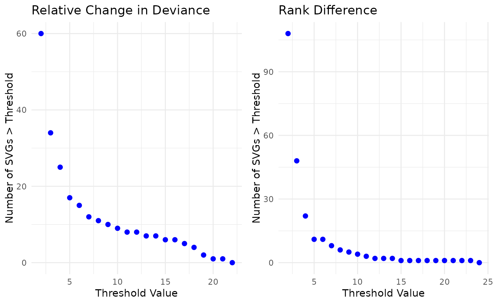

# Find Batch-biased SVGs

## Introduction

A standard task in the analysis of spatially resolved transcriptomics
(SRT) data is to identify spatially variable genes (SVGs). This is most
commonly done within one tissue section at a time because the spatial
relationships between the tissue sections are typically unknown. One
challenge is how to identify and remove SVGs that are associated with a
known bias or technical artifact, such as the slide or capture area,
which can lead to poor performance in downstream analyses, such as
spatial domain detection. Here, we introduce `BatchSVG`, a tool to
identify biased features associated with batch effect(s) (e.g. sample,
slide, and sex) in a set of SVGs. Our approach compares the rank of
per-gene deviance under a binomial model (i) with and (ii) without
including a covariate in the model that is associated with the known
bias or technical artifact. If the rank of a feature changes
significantly between these, then we infer that this gene is likely
associated with the bias or technical artifact and should be removed
from the downstream analysis. The package is compatible with
[SpatialExperiment](https://github.com/drighelli/SpatialExperiment)
objects.

## Installation

``` r

if (!requireNamespace("BiocManager")) {
    install.packages("BiocManager")
}
BiocManager::install("BatchSVG")
```

To install the development version from
[GitHub](https://christinehou11.github.io/BatchSVG) instead:

``` r

remotes::install("christinehou11/BatchSVG")
```

## Biased Feature Identification

In this section, we will demonstrate the workflow for using `BatchSVG`
and show how the method helps to detect and visualize batch-biased SVGs.
We will use an SRT dataset from the
[WeberDivechaLCdata](https://bioconductor.org/packages/release/data/experiment/html/WeberDivechaLCdata.html)
package.

``` r

library(BatchSVG)
library(WeberDivechaLCdata)
library(cowplot)
library(ggplot2)
```

``` r
spe <- WeberDivechaLCdata_Visium()
spe
class: SpatialExperiment 
dim: 23728 20380 
metadata(0):
assays(2): counts logcounts
rownames(23728): ENSG00000238009 ENSG00000241860 ... ENSG00000278817
  ENSG00000277196
rowData names(6): source type ... gene_name gene_type
colnames(20380): Br6522_LC_1_round1_AAACAAGTATCTCCCA-1
  Br6522_LC_1_round1_AAACACCAATAACTGC-1 ...
  Br8153_LC_round3_TTGTTTGTATTACACG-1
  Br8153_LC_round3_TTGTTTGTGTAAATTC-1
colData names(20): sample_id donor_id ... discard sizeFactor
reducedDimNames(0):
mainExpName: NULL
altExpNames(0):
spatialCoords names(2) : pxl_col_in_fullres pxl_row_in_fullres
imgData names(4): sample_id image_id data scaleFactor
```

We will use an SVG set that was previously generated using the
[nnSVG](NA) package.

``` r

svgs <- read.csv("svgs_LC.csv", check.names = FALSE)
```

### Perform Feature Selection using `featureSelect()`

This function performs feature selection on a chosen subset of SRT data
(*input*) using a predefined set of SVGs (*VGs*).

To assess the impact of the batch variable in the SRT data, we fit a
binomial model per gene (i) with and (ii) without including a covariate
in the model that is associated with the batch effect or unwanted
variation. Using this model output, we define $`d_{i, \text{ default}}`$
and $`d_{i, \text{ batch name}}`$ as the residual deviance for gene
$`i`$ using a binomial model with and without the batch effect,
respectively. We calculate a per-gene relative change in deviance (RCD)
as
$`{RCD}_i = \frac{d_{i, \text{ default}} - d_{i, \text{ batch name}}}{d_{i, \text{ batch name}}}`$.
Generally, a higher per-gene deviance $`d_i`$ suggests that the gene’s
expression is more likely to be biologically meaningful. Therefore, a
reduction in deviance after accounting for the batch covariate indicates
that the batch explains a portion of the variation in gene expression
that was previously attributed to biological differences.

In addition to the residual deviance itself, we also consider the ranks
of the residual deviances where top-ranked genes have the largest
residual deviance and are considered more important. Here, an increase
in rank (e.g. from a rank of 1 to a rank of 500) when including the
batch variable indicates that the relative importance of the feature is
diminished once the batch variable is accounted for. Therefore, in
addition to RCD, we also evaluated the rank deviance (RD), which is
defined as
$`{RD}_i = r_{i, \text{ batch name}} - r_{i, \text{ default}}`$, where
$`r_{i, \text{ default}}`$ and $`r_{i, \text{ batch name}}`$ are the
per-gene rank when the binomial deviance model is run with and without
the batch variable, respectively.

The
[`featureSelect()`](https://christinehou11.github.io/BatchSVG/reference/featureSelect.md)
function enables feature selection while accounting for multiple batch
effects. It returns a **list** of data frames, where each batch effect
is associated with a corresponding data frame containing key results,
including:

- Relative change in deviance before and after batch effect adjustment
  (RCD)

- Rank differences before and after batch effect adjustment (RD)

- Number of standard deviations (nSD) for both relative change in
  deviance and rank difference

We use apply
[`featureSelect()`](https://christinehou11.github.io/BatchSVG/reference/featureSelect.md)
to the example dataset while adjusting for the batch effect of
*sample_id*.

``` r
list_batch_df <- featureSelect(input = spe, 
    batch_effect = "sample_id", VGs = svgs$gene_id)
Running feature selection with batch...
Batch Effect: sample_id
Running feature selection without batch...
Calculating deviance and rank difference...
```

``` r

list_batch_df <- featureSelect(input = spe, 
    batch_effect = "sample_id", VGs = svgs$gene_id, verbose = FALSE)
```

``` r
class(list_batch_df)
[1] "list"
```

``` r
head(list_batch_df$sample_id)
          gene_id gene_name dev_default rank_default dev_sample_id
1 ENSG00000188976     NOC2L    3887.944         3652      3876.663
2 ENSG00000188290      HES4    6072.325         2060      6002.105
3 ENSG00000187608     ISG15    6148.214         2016      5375.132
4 ENSG00000078808      SDF4    6197.494         1989      6174.812
5 ENSG00000131584     ACAP3    4072.886         3567      4050.140
6 ENSG00000107404      DVL1    4934.273         2925      4905.259
  rank_sample_id      d_diff nSD_dev_sample_id r_diff nSD_rank_sample_id
1           3619 0.002909944        -0.4134735    -33         -0.4564835
2           2030 0.011699089        -0.3080473    -30         -0.4149850
3           2461 0.143825761         1.2768180    445          6.1556106
4           1914 0.003673372        -0.4043162    -75         -1.0374625
5           3518 0.005615986        -0.3810144    -49         -0.6778088
6           2864 0.005914856        -0.3774295    -61         -0.8438028
```

### Visualize SVG Selection Using `svg_nSD()`

The
[`svg_nSD()`](https://christinehou11.github.io/BatchSVG/reference/svg_nSD.md)
function generates visualizations to assess the impact of the batch
variable(s) on the SVGs. It produces bar charts of the distribution of
SVGs based on relative change in deviance and rank difference, with
colors representing different nSD intervals. Additionally, the
scatterplots compare deviance and rank values with and without batch
effects. Using these plots, we can determine appropriate nSD thresholds
for filtering batch-biased SVGs.

The SVGs in red and very far off the line are most likely to be
batch-biased SVGs since their deviance and/or rank values are more
changed compared to the other SVGs.

``` r

plots <- svg_nSD(list_batch_df = list_batch_df, 
            sd_interval_dev = 5, sd_interval_rank = 5)
```

*Figure 1. Visualizations of nSD_dev and nSD_rank threshold selection*

``` r

plots$sample_id
```


### Identify Biased Genes Using `biasDetect()`

The function
[`biasDetect()`](https://christinehou11.github.io/BatchSVG/reference/biasDetect.md)
is designed to identify and filter out batch-biased SVGs across
different batch effects. Using threshold values selected from the
visualization results generated by
[`svg_nSD()`](https://christinehou11.github.io/BatchSVG/reference/svg_nSD.md),
this function detects outliers that exceed a specified number of
standard deviation (nSD) threshold in either relative change in
deviance, rank difference, or both.

The function outputs visualizations comparing deviance and rank values
with and without batch effects. Genes with high deviations, highlighted
in color, are identified as potentially biased and can be excluded based
on the selected nSD thresholds.

The function offers flexibility in customizing plot aesthetics, allowing
users to adjust the point size (**plot_point_size**), shape
(**plot_point_shape**), annotated text size (**plot_text_size**), and
color palette (**plot_palette**). Default values are provided for these
parameters if not specified. Users should refer to the
[ggplot2](https://ggplot2.tidyverse.org/index.html) aesthetic guidelines
to ensure appropriate values are assigned for each parameter.

We will use `nSD_dev = 10` and `nSD_rank = 8` for the example. Users
should adjust these values based on their datasets. We also include a
brief sensitivity analysis below, visualizing how the number of
identified batch-biased genes varies across a range of nSD values. We
have chosen relatively high thresholds in this example to be more
conservative with the SVGs we will filter out of the SVG list.

``` r


vec_dev <- list_batch_df$sample_id$nSD_dev_sample_id[list_batch_df$sample_id$nSD_dev_sample_id > 0]
x_values <- 2:round(max(vec_dev))

counts <- sapply(x_values, function(x) sum(vec_dev > x))

df <- data.frame(
  threshold = x_values,
  count = counts
)

p1 <- ggplot(df, aes(x = threshold, y = count)) +
  geom_point(color = "blue", size = 2) +
  labs(x = "Threshold Value",
       y = "Number of SVGs > Threshold",
       title = "Relative Change in Deviance") +
  theme_minimal()

vec_rank <- list_batch_df$sample_id$nSD_rank_sample_id[list_batch_df$sample_id$nSD_rank_sample_id > 0]
x_values <- 2:round(max(vec_rank))

counts <- sapply(x_values, function(x) sum(vec_rank > x))

df <- data.frame(
  threshold = x_values,
  count = counts
)

p2 <- ggplot(df, aes(x = threshold, y = count)) +
  geom_point(color = "blue", size = 2) +
  labs(x = "Threshold Value",
       y = "Number of SVGs > Threshold",
       title = "Rank Difference") +
  theme_minimal()

plot_grid(p1,p2)
```



**Usage of Different Threshold Options**

- `threshold = "dev"`: Filters batch-biased SVGs based only on the
  relative change in deviance. Genes with deviance changes exceeding the
  specified `nSD_dev` threshold are identified as batch-biased and can
  be removed.

``` r

bias_dev <- biasDetect(list_batch_df = list_batch_df, 
    threshold = "dev", nSD_dev = 10)
```

*Table 1. Outlier Genes defined by nSD_dev only*

``` r
head(bias_dev$sample_id$Table)
          gene_id gene_name dev_default rank_default dev_sample_id
1 ENSG00000164241   C5orf63    39655.17           16      20707.20
2 ENSG00000198888    MT-ND1   218960.47            3      87994.48
3 ENSG00000198804    MT-CO1   214336.22            5      83576.35
4 ENSG00000198712    MT-CO2   223708.64            2      78899.48
5 ENSG00000198899   MT-ATP6   215486.64            4      81755.33
6 ENSG00000198938    MT-CO3   260433.30            1     100030.36
  rank_sample_id    d_diff nSD_dev_sample_id r_diff nSD_rank_sample_id
1             57 0.9150424          10.52760     41         0.56714614
2              4 1.4883431          17.40436      1         0.01383283
3              5 1.5645560          18.31854      0         0.00000000
4              7 1.8353625          21.56688      5         0.06916416
5              6 1.6357505          19.17252      2         0.02766567
6              3 1.6035425          18.78619      2         0.02766567
  nSD_bin_dev dev_outlier
1     [10,20)        TRUE
2     [10,20)        TRUE
3     [10,20)        TRUE
4     [20,30]        TRUE
5     [10,20)        TRUE
6     [10,20)        TRUE
```

We can change point size using **plot_point_size**.

``` r

# size default = 3
bias_dev_size <- biasDetect(list_batch_df = list_batch_df, 
    threshold = "dev", nSD_dev = 10, plot_point_size = 4)
```

*Figure 2. Customize point size*

``` r

plot_grid(bias_dev$sample_id$Plot, bias_dev_size$sample_id$Plot)
```


- `threshold = "rank"`: Identifies biased genes based only on rank
  difference. Genes with rank shifts exceeding `nSD_rank` are considered
  batch-biased.

``` r

bias_rank <- biasDetect(list_batch_df = list_batch_df, 
    threshold = "rank", nSD_rank = 8)
```

*Table 2. Outlier Genes defined by nSD_rank only*

``` r
head(bias_rank$sample_id$Table)
          gene_id gene_name dev_default rank_default dev_sample_id
1 ENSG00000173372      C1QA    5524.224         2429      4531.851
2 ENSG00000173369      C1QB    8344.491         1046      5922.112
3 ENSG00000162511    LAPTM5    6101.099         2040      5159.188
4 ENSG00000270188 MTRNR2L11    7880.694         1182      5976.601
5 ENSG00000196136  SERPINA3    6616.945         1753      4130.295
6 ENSG00000105519      CAPS   10670.300          600      7356.179
  rank_sample_id    d_diff nSD_dev_sample_id r_diff nSD_rank_sample_id
1           3198 0.2189775          2.178266    769          10.637448
2           2087 0.4090398          4.458072   1041          14.399979
3           2653 0.1825696          1.741552    613           8.479526
4           2047 0.3185914          3.373140    865          11.965400
5           3469 0.6020515          6.773256   1716          23.737141
6           1307 0.4505222          4.955655    707           9.779813
  nSD_bin_rank rank_outlier
1       [8,16)         TRUE
2       [8,16)         TRUE
3       [8,16)         TRUE
4       [8,16)         TRUE
5      [16,24]         TRUE
6       [8,16)         TRUE
```

We can change point shape using **plot_point_shape**.

*Figure 3. Customize point shape*

``` r

# shape default = 16
bias_rank_shape <- biasDetect(list_batch_df = list_batch_df, 
    threshold = "rank", nSD_rank = 8, plot_point_shape = 2)

plot_grid(bias_rank$sample_id$Plot, bias_rank_shape$sample_id$Plot)
```


- `threshold = "both"`: Detects biased genes based on both relative
  change in deviance and rank difference, providing a more stringent
  filtering approach.

``` r

bias_both <- biasDetect(list_batch_df = list_batch_df, threshold = "both",
    nSD_dev = 10, nSD_rank = 8)
```

*Table 3. Outlier Genes defined by nSD_dev and nSD_rank*

``` r
head(bias_both$sample_id$Table)
          gene_id gene_name dev_default rank_default dev_sample_id
1 ENSG00000173372      C1QA    5524.224         2429      4531.851
2 ENSG00000173369      C1QB    8344.491         1046      5922.112
3 ENSG00000162511    LAPTM5    6101.099         2040      5159.188
4 ENSG00000270188 MTRNR2L11    7880.694         1182      5976.601
5 ENSG00000164241   C5orf63   39655.169           16     20707.201
6 ENSG00000196136  SERPINA3    6616.945         1753      4130.295
  rank_sample_id    d_diff nSD_dev_sample_id r_diff nSD_rank_sample_id
1           3198 0.2189775          2.178266    769         10.6374484
2           2087 0.4090398          4.458072   1041         14.3999789
3           2653 0.1825696          1.741552    613          8.4795265
4           2047 0.3185914          3.373140    865         11.9654003
5             57 0.9150424         10.527596     41          0.5671461
6           3469 0.6020515          6.773256   1716         23.7371410
  nSD_bin_dev dev_outlier nSD_bin_rank rank_outlier
1      [0,10)       FALSE       [8,16)         TRUE
2      [0,10)       FALSE       [8,16)         TRUE
3      [0,10)       FALSE       [8,16)         TRUE
4      [0,10)       FALSE       [8,16)         TRUE
5     [10,20)        TRUE        [0,8)        FALSE
6      [0,10)       FALSE      [16,24]         TRUE
```

We can change point color using **plot_palette**. The color palette
[here](https://r-graph-gallery.com/38-rcolorbrewers-palettes.html) can
be referenced as the function uses `RColorBrewer` to generate colors.

*Figure 4. Customize the palette color*

``` r

# color default = "YlOrRd"
bias_both_color <- biasDetect(list_batch_df = list_batch_df, 
    threshold = "both", nSD_dev = 10, nSD_rank = 8, plot_palette = "Greens")

plot_grid(bias_both$sample_id$Plot, bias_both_color$sample_id$Plot,nrow = 2)
```


We can change text size using **plot_text_size**. We can also specify
unique color palettes for both batch effects.

*Figure 5. Customize text size and color palette*

``` r

# text size default = 3
bias_both_color_text <- biasDetect(list_batch_df = list_batch_df, 
    threshold = "both", nSD_dev = 10, nSD_rank = 8, 
    plot_palette = c("Blues"), plot_text_size = 4)

plot_grid(bias_both$sample_id$Plot, bias_both_color_text$sample_id$Plot,nrow = 2)
```


### Refine SVGs by Removing Batch-Affected Outliers

Finally, we obtain a refined set of SVGs by removing the batch-biased
SVGs based on user-defined thresholds for `nSD_dev` and `nSD_rank`.

Here, we use the results from bias_both, which applied
`threshold = "both"` to account for both deviance and rank differences.

``` r
bias_both_df <- bias_both$sample_id$Table
svgs_filt <- setdiff(svgs$gene_id, bias_both_df$gene_id)
svgs_filt_spe <- svgs[svgs$gene_id %in% svgs_filt, ]
nrow(svgs_filt_spe)
[1] 3890
```

After obtaining the refined set of SVGs, these genes can be further
analyzed using established SRT clustering algorithms to explore tissue
layers and spatial organization.

## `R` session information

``` r

## Session info
sessionInfo()
#> R version 4.6.0 (2026-04-24)
#> Platform: x86_64-pc-linux-gnu
#> Running under: Ubuntu 24.04.4 LTS
#> 
#> Matrix products: default
#> BLAS:   /usr/lib/x86_64-linux-gnu/openblas-pthread/libblas.so.3 
#> LAPACK: /usr/lib/x86_64-linux-gnu/openblas-pthread/libopenblasp-r0.3.26.so;  LAPACK version 3.12.0
#> 
#> locale:
#>  [1] LC_CTYPE=C.UTF-8       LC_NUMERIC=C           LC_TIME=C.UTF-8       
#>  [4] LC_COLLATE=C.UTF-8     LC_MONETARY=C.UTF-8    LC_MESSAGES=C.UTF-8   
#>  [7] LC_PAPER=C.UTF-8       LC_NAME=C              LC_ADDRESS=C          
#> [10] LC_TELEPHONE=C         LC_MEASUREMENT=C.UTF-8 LC_IDENTIFICATION=C   
#> 
#> time zone: UTC
#> tzcode source: system (glibc)
#> 
#> attached base packages:
#> [1] stats4    stats     graphics  grDevices utils     datasets  methods  
#> [8] base     
#> 
#> other attached packages:
#>  [1] ggplot2_4.0.3               cowplot_1.2.0              
#>  [3] WeberDivechaLCdata_1.14.0   SpatialExperiment_1.22.0   
#>  [5] SingleCellExperiment_1.34.0 SummarizedExperiment_1.42.0
#>  [7] Biobase_2.72.0              GenomicRanges_1.64.0       
#>  [9] Seqinfo_1.2.0               IRanges_2.46.0             
#> [11] S4Vectors_0.50.1            MatrixGenerics_1.24.0      
#> [13] matrixStats_1.5.0           ExperimentHub_3.2.0        
#> [15] AnnotationHub_4.2.0         BiocFileCache_3.2.0        
#> [17] dbplyr_2.5.2                BiocGenerics_0.58.1        
#> [19] generics_0.1.4              BatchSVG_1.5.3             
#> [21] BiocStyle_2.40.0           
#> 
#> loaded via a namespace (and not attached):
#>  [1] tidyselect_1.2.1     dplyr_1.2.1          farver_2.1.2        
#>  [4] blob_1.3.0           Biostrings_2.80.1    filelock_1.0.3      
#>  [7] S7_0.2.2             fastmap_1.2.0        digest_0.6.39       
#> [10] rsvd_1.0.5           lifecycle_1.0.5      KEGGREST_1.52.0     
#> [13] RSQLite_3.53.1       magrittr_2.0.5       compiler_4.6.0      
#> [16] rlang_1.2.0          sass_0.4.10          tools_4.6.0         
#> [19] yaml_2.3.12          knitr_1.51           labeling_0.4.3      
#> [22] S4Arrays_1.12.0      htmlwidgets_1.6.4    bit_4.6.0           
#> [25] curl_7.1.0           DelayedArray_0.38.2  RColorBrewer_1.1-3  
#> [28] abind_1.4-8          BiocParallel_1.46.0  purrr_1.2.2         
#> [31] withr_3.0.2          desc_1.4.3           grid_4.6.0          
#> [34] beachmat_2.28.0      scales_1.4.0         cli_3.6.6           
#> [37] crayon_1.5.3         rmarkdown_2.31       ragg_1.5.2          
#> [40] otel_0.2.0           rjson_0.2.23         httr_1.4.8          
#> [43] DBI_1.3.0            cachem_1.1.0         parallel_4.6.0      
#> [46] AnnotationDbi_1.74.0 BiocManager_1.30.27  XVector_0.52.0      
#> [49] vctrs_0.7.3          Matrix_1.7-5         jsonlite_2.0.0      
#> [52] bookdown_0.46        BiocSingular_1.28.0  bit64_4.8.2         
#> [55] ggrepel_0.9.8        scry_1.24.0          irlba_2.3.7         
#> [58] magick_2.9.1         systemfonts_1.3.2    jquerylib_0.1.4     
#> [61] glue_1.8.1           pkgdown_2.2.0        codetools_0.2-20    
#> [64] gtable_0.3.6         BiocVersion_3.23.1   ScaledMatrix_1.20.0 
#> [67] tibble_3.3.1         pillar_1.11.1        rappdirs_0.3.4      
#> [70] htmltools_0.5.9      R6_2.6.1             httr2_1.2.2         
#> [73] textshaping_1.0.5    evaluate_1.0.5       lattice_0.22-9      
#> [76] png_0.1-9            memoise_2.0.1        bslib_0.11.0        
#> [79] Rcpp_1.1.1-1.1       SparseArray_1.12.2   xfun_0.58           
#> [82] fs_2.1.0             pkgconfig_2.0.3
```
