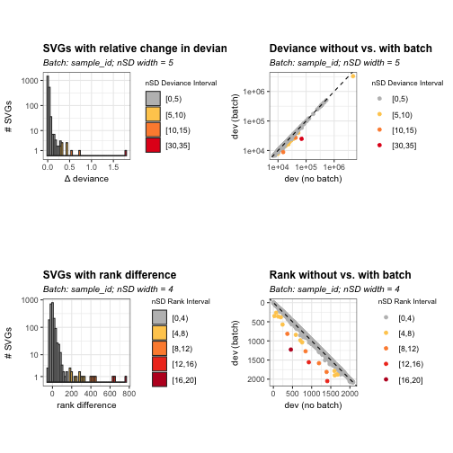
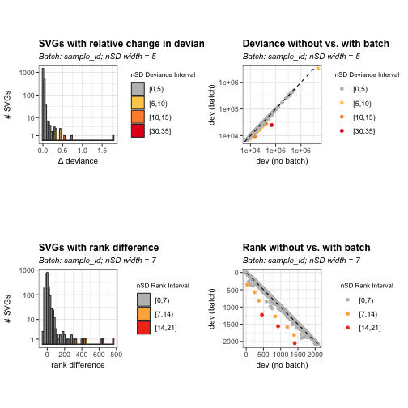
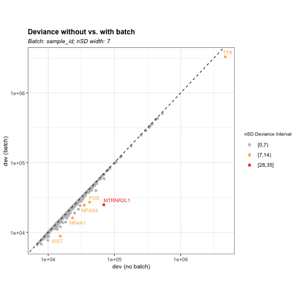

### Introduction

`BatchSVG` is the R/Bioconductor package for spatial transcriptomics data 
quality control (QC). As the feature-based QC method, the package provides 
functions to identify the biased features associated with the batch effect(s) 
(e.g. sample,  slide, and sex) in spatially variable genes (SVGs) using 
binomial deviance model, aiming to develop the downstream clustering 
performances and remove the technical noises caused by batch effects. The 
package works with 
[SpatialExperiment](https://github.com/drighelli/SpatialExperiment) objects. 

### Installation

(After accepted in [Bioconductor](https://bioconductor.org/)). 


``` r
if (!requireNamespace("BiocManager")) {
    install.packages("BiocManager")
}
BiocManager::install("HuBMAPR")
```

Install the development version from 
[GitHub](https://christinehou11.github.io/BatchSVG).


``` r
remotes::install("christinehou11/BatchSVG")
```

### Biased Feature Identification

In this section, we will include the standard workflow for using `BatchSVG` to
show how the method help to detect and visualize the biased features in SVGs. 


``` r
library(BatchSVG)
# library(humanHippocampus2024)
library(ExperimentHub)
library(SpatialExperiment)
library(SummarizedExperiment)
library(tidyr)
library(dplyr)
library(tibble)
```

#### Data

We will use the `spatially-resolved transcriptomics (SRT)` dataset from the 
adjacent tissue sections of the anterior human hippocampus across ten adult 
neurotypical donors. The dataset is obtained from `humanHippocampus2024` 
package which currently is in the 
[development version](https://bioconductor.org/packages/humanHippocampus2024/)
on Bioconductor 3.21, and it is the `spatialExperiment` object generated and 
processed from the [spatial_HPC](https://github.com/LieberInstitute/spatial_hpc)
project. 


``` r
ehub <- ExperimentHub()
spe <- ehub[["EH9605"]]
spe
class: SpatialExperiment 
dim: 31483 150917 
metadata(1): Obtained_from
assays(2): counts logcounts
rownames(31483): MIR1302-2HG AL627309.1 ... AC007325.4 AC007325.2
rowData names(7): source type ... gene_type gene_search
colnames(150917): AAACAACGAATAGTTC-1_V10B01-086_D1 AAACAAGTATCTCCCA-1_V10B01-086_D1 ...
  TTGTTTCCATACAACT-1_Br2720_B1 TTGTTTGTATTACACG-1_Br2720_B1
colData names(150): sample_id in_tissue ... nmf99 nmf100
reducedDimNames(3): 10x_pca 10x_tsne 10x_umap
mainExpName: NULL
altExpNames(0):
spatialCoords names(2) : pxl_col_in_fullres pxl_row_in_fullres
imgData names(4): sample_id image_id data scaleFactor
```

We will use the spatially variable genes set generated from 
[spatial_HPC](https://github.com/LieberInstitute/spatial_hpc) project. The 
result is generated from 
[nnSVG]((https://www.nature.com/articles/s41467-023-39748-z)) package.

We will select four samples from the raw data as an example:

- V11L05-333_B1

- V11L05-333_D1

- V11L05-335_D1

- V11L05-336_A1. 


``` r
fix_order <- distinct(
    as.data.frame(colData(spe)), slide, array, brnum, sample_id, 
    position, sex) %>% 
    arrange(slide, array)
sub4 <- fix_order$sample_id[c(14,16, 20,21)]

spe_sub4 <- spe[,spe$sample_id %in% sub4]
spe_sub4 # 31483, 18945
class: SpatialExperiment 
dim: 31483 18945 
metadata(1): Obtained_from
assays(2): counts logcounts
rownames(31483): MIR1302-2HG AL627309.1 ... AC007325.4 AC007325.2
rowData names(7): source type ... gene_type gene_search
colnames(18945): AAACAACGAATAGTTC-1_V11L05-333_B1 AAACAAGTATCTCCCA-1_V11L05-333_B1 ...
  TTGTTTGTATTACACG-1_V11L05-336_A1 TTGTTTGTGTAAATTC-1_V11L05-336_A1
colData names(150): sample_id in_tissue ... nmf99 nmf100
reducedDimNames(3): 10x_pca 10x_tsne 10x_umap
mainExpName: NULL
altExpNames(0):
spatialCoords names(2) : pxl_col_in_fullres pxl_row_in_fullres
imgData names(4): sample_id image_id data scaleFactor
```

We will refine our selection to include only the top 2,000 ranked 
features (rank$\leq$ 2000) and only genes that appear in more than one sample
(n > 1).

After applying these criteria, we obtain 2,082 spatially variable genes across 
the four samples.


``` r
# res_ranks: SVGs results with rank values
res_df_sub <- pivot_longer(
    rownames_to_column(as.data.frame(res_ranks), var<-"gene_id"), 
        colnames(res_ranks), 
    names_to="sample_id", 
    values_to="rank", 
    values_drop_na=TRUE)
    
res_df_sub <- filter(res_df_sub,
    sample_id %in% 
        c("V11L05-333_B1", "V11L05-333_D1", "V11L05-335_D1", "V11L05-336_A1"), 
    rank <= 2000) # top 2k sig features
    
svgs_sub4 <- group_by(res_df_sub, gene_id) |>
    tally() |> 
    filter(n>1)
```


```
[1] 2082
```


``` r
nrow(svgs_sub4)
```

#### Perform Feature Selection using `featureSelect()`

We will perform feature selection on a subset of spatial transcriptomics data 
(*input*) using a predefined set of spatially variable genes (*VGs*). 
Specifically, we will compute the number of standard deviations for the relative
change in deviance (**nSD_dev_{batch effect}**) and rank difference 
(**nSD_rank_{batch effect}**) before and after adjusting for batch effects.

The `featureSelect()` function enables feature selection while accounting for 
multiple batch effects. It returns a **list** of data frames, where each batch 
effect is associated with a corresponding data frame containing key results, 
including:

- Relative change in deviance before and after batch effect adjustment

- Rank differences between the batch-corrected and uncorrected results

- Number of standard deviations (nSD) for both relative change in deviance and 
rank difference

We will use the example of applying `featureSelect()` to a four sample dataset
while adjusting for the batch effect *sample_id* and *sex*.


``` r
SVGs <- svgs_sub4$gene_id
list_batch_df <- featureSelect(input = spe_sub4, 
    batch_effect = c("sample_id", "sex"), VGs = SVGs)
Running feature selection without batch...
Batch Effect:sample_id
Running feature selection without batch...
Calculating deviance and rank difference...
Batch Effect:sex
Running feature selection without batch...
Calculating deviance and rank difference...
```


``` r
class(list_batch_df)
[1] "list"
```


``` r
head(list_batch_df$sample_id)
          gene_id gene_name dev_default rank_default dev_sample_id rank_sample_id       d_diff
1 ENSG00000131584     ACAP3    16125.31         1262      15900.14           1269 0.0141612453
2 ENSG00000175756  AURKAIP1    17344.09         1060      17167.86           1058 0.0102651525
3 ENSG00000242485    MRPL20    17629.33         1023      17517.05           1004 0.0064098269
4 ENSG00000179403      VWA1    12860.93         1726      12825.66           1702 0.0027493688
5 ENSG00000160075     SSU72    16145.20         1255      16136.31           1220 0.0005506572
6 ENSG00000078369      GNB1    22402.83          516      22271.32            497 0.0059049925
  nSD_dev_sample_id r_diff nSD_rank_sample_id
1       -0.09513109      7         0.16380252
2       -0.16945410     -2        -0.04680072
3       -0.24299943    -19        -0.44460683
4       -0.31282741    -24        -0.56160863
5       -0.35477067    -35        -0.81901258
6       -0.25262980    -19        -0.44460683
```


``` r
head(list_batch_df$sex)
          gene_id gene_name dev_default rank_default  dev_sex rank_sex       d_diff nSD_dev_sex
1 ENSG00000131584     ACAP3    16125.31         1262 16118.48     1250 4.234208e-04  -0.2615600
2 ENSG00000175756  AURKAIP1    17344.09         1060 17247.44     1064 5.603690e-03  -0.1013769
3 ENSG00000242485    MRPL20    17629.33         1023 17585.70     1013 2.480783e-03  -0.1979427
4 ENSG00000179403      VWA1    12860.93         1726 12860.90     1709 1.811106e-06  -0.2745969
5 ENSG00000160075     SSU72    16145.20         1255 16141.12     1243 2.527558e-04  -0.2668373
6 ENSG00000078369      GNB1    22402.83          516 22314.17      509 3.973515e-03  -0.1517848
  r_diff nSD_rank_sex
1    -12   -0.3080188
2      4    0.1026729
3    -10   -0.2566824
4    -17   -0.4363600
5    -12   -0.3080188
6     -7   -0.1796776
```

#### Visualize SVG Selection Using `svg_nSD` for Batch Effects

The `svg_nSD()` function generates visualizations to assess batch effects in 
spatially variable genes (SVGs). It produces bar charts showing the distribution
of SVGs based on relative change in deviance and rank difference, with colors 
representing different nSD intervals. Additionally, scatter plots compare 
deviance and rank values with and without batch effects.

By interpreting these plots, we can determine appropriate nSD thresholds for
filtering biased features. The left panels illustrate the distribution of SVGs 
in terms of deviance and rank difference, while the right panels compare values 
before and after accounting for batch effects.


``` r
plots <- svg_nSD(list_batch_df = list_batch_df, 
                sd_interval_dev = c(5,4), sd_interval_rank = c(4,6))
plots$sample_id
```



``` r
plots$sex
```


We can also apply `svg_nSD()` to a single batch effect. Note that the function 
requires the input to be a list of data frames, even when analyzing only one 
batch.


``` r
plots <- svg_nSD(list_batch_df = list_batch_df[1], 
                sd_interval_dev = 5, sd_interval_rank = 7)
plots$sample_id
```



#### Identify Biased Genes Using `biasDetect()`

The function `biasDetect()` is designed to identify and filter out biased genes
across different batch effects. Using threshold values selected from
the visualization results generated by `svg_nSD()`, this function systematically
detects outliers that exceed a specified normalized standard deviation (nSD) 
threshold in either relative deviance change, rank difference, or both.

The function outputs visualizations comparing deviance and rank values with and 
without batch effects. Genes with high deviations, highlighted in color, are 
identified as potentially biased and can be excluded based on the selected nSD 
thresholds.

We will use `nSD_dev = 7` and `nSD_rank = 6` as the example. The user should 
adjust the value based on their dataset features.

**Usage of Different Threshold Options**

- `threshold = "dev"`: Filters biased genes based only on the relative change 
in deviance. Genes with deviance changes exceeding the specified `nSD_dev`
threshold are identified as batch-affected and can be removed.


``` r
bias_dev <- biasDetect(list_batch_df = list_batch_df, 
                        threshold = "dev", nSD_dev = 7)
```


``` r
head(bias_dev$sample_id$Table)
          gene_id gene_name dev_default rank_default dev_sample_id rank_sample_id    d_diff
1 ENSG00000174576     NPAS4    35003.31          125     24629.414            363 0.4211996
2 ENSG00000123358     NR4A1    23299.81          457     16115.928           1226 0.4457631
3 ENSG00000170345       FOS    42305.65           73     27146.089            263 0.5584435
4 ENSG00000256618  MTRNR2L1    69206.34           28     24876.086            351 1.7820430
5 ENSG00000118271       TTR  4719046.58            1   3292127.945              1 0.4334335
6 ENSG00000229807      XIST    15223.50         1408      8819.689           2050 0.7260812
  nSD_dev_sample_id r_diff nSD_rank_sample_id nSD_bin_dev dev_outlier
1          7.669653    238           5.569286      [7,14)        TRUE
2          8.138234    769          17.994876      [7,14)        TRUE
3         10.287758    190           4.446068      [7,14)        TRUE
4         33.629502    323           7.558316     [28,35]        TRUE
5          7.903030      0           0.000000      [7,14)        TRUE
6         13.485664    642          15.023031      [7,14)        TRUE
```


``` r
bias_dev$sample_id$Plot
```



- `threshold = "rank"`: Identifies biased genes based solely on rank difference.
Genes with rank shifts exceeding `nSD_rank` are considered biased.


