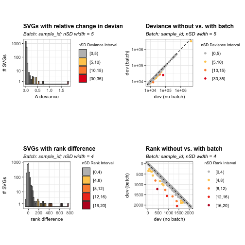
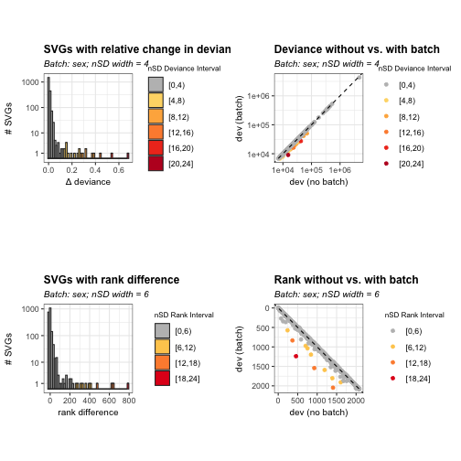
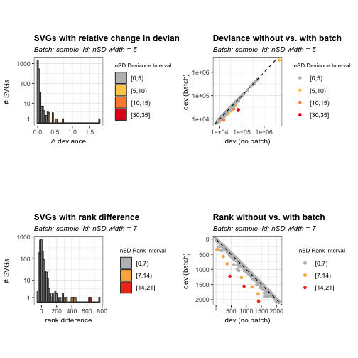
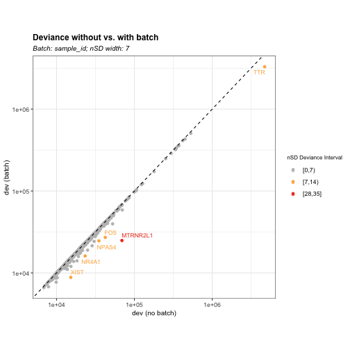
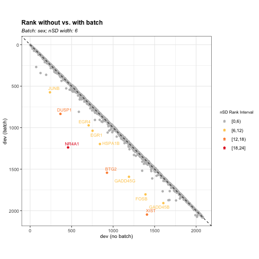
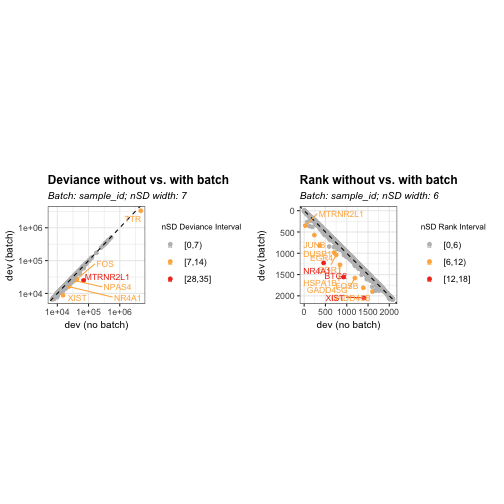
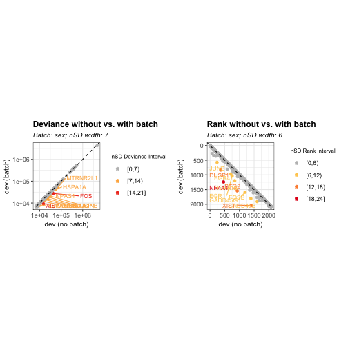

### Introduction

`BatchSVG` is the R/Bioconductor package for spatial transcriptomics data 
quality control (QC). As the feature-based QC method, the package provides 
functions to identify the biased features associated with the batch effect(s) 
(e.g. sample,  slide, and sex) in spatially variable genes (SVGs) using 
binomial deviance model, aiming to develop the downstream clustering 
performances and remove the technical noises caused by batch effects. The 
package works with 
[SpatialExperiment](https://github.com/drighelli/SpatialExperiment) objects. 

### Installation

(After accepted in [Bioconductor](https://bioconductor.org/)). 


``` r
if (!requireNamespace("BiocManager")) {
    install.packages("BiocManager")
}
BiocManager::install("HuBMAPR")
```

Install the development version from 
[GitHub](https://christinehou11.github.io/BatchSVG).


``` r
remotes::install("christinehou11/BatchSVG")
```

### Biased Feature Identification

In this section, we will include the standard workflow for using `BatchSVG` to
show how the method help to detect and visualize the biased features in SVGs. 


``` r
library(BatchSVG)
# library(humanHippocampus2024)
library(ExperimentHub)
library(SpatialExperiment)
library(SummarizedExperiment)
library(tidyr)
library(dplyr)
library(tibble)
```

#### Data

We will use the `spatially-resolved transcriptomics (SRT)` dataset from the 
adjacent tissue sections of the anterior human hippocampus across ten adult 
neurotypical donors. The dataset is obtained from `humanHippocampus2024` 
package which currently is in the 
[development version](https://bioconductor.org/packages/humanHippocampus2024/)
on Bioconductor 3.21, and it is the `spatialExperiment` object generated and 
processed from the [spatial_HPC](https://github.com/LieberInstitute/spatial_hpc)
project. 


``` r
ehub <- ExperimentHub()
spe <- ehub[["EH9605"]]
spe
#> class: SpatialExperiment 
#> dim: 2082 18945 
#> metadata(1): Obtained_from
#> assays(2): counts logcounts
#> rownames(2082): ENSG00000131584 ENSG00000175756 ... ENSG00000198695
#>   ENSG00000198727
#> rowData names(7): source type ... gene_type gene_search
#> colnames(18945): AAACAACGAATAGTTC-1_V11L05-333_B1
#>   AAACAAGTATCTCCCA-1_V11L05-333_B1 ... TTGTTTGTATTACACG-1_V11L05-336_A1
#>   TTGTTTGTGTAAATTC-1_V11L05-336_A1
#> colData names(150): sample_id in_tissue ... nmf99 nmf100
#> reducedDimNames(3): 10x_pca 10x_tsne 10x_umap
#> mainExpName: NULL
#> altExpNames(0):
#> spatialCoords names(2) : pxl_col_in_fullres pxl_row_in_fullres
#> imgData names(4): sample_id image_id data scaleFactor
```

We will use the spatially variable genes set generated from 
[spatial_HPC](https://github.com/LieberInstitute/spatial_hpc) project. The 
result is generated from 
[nnSVG]((https://www.nature.com/articles/s41467-023-39748-z)) package.

We will select four samples from the raw data as an example:

- V11L05-333_B1

- V11L05-333_D1

- V11L05-335_D1

- V11L05-336_A1. 


``` r
fix_order <- distinct(
    as.data.frame(colData(spe)), slide, array, brnum, sample_id, 
    position, sex) %>% 
    arrange(slide, array)
sub4 <- fix_order$sample_id[c(14,16, 20,21)]

spe_sub4 <- spe[,spe$sample_id %in% sub4]
spe_sub4 # 31483, 18945
```


```
class: SpatialExperiment 
dim: 2082 18945 
metadata(1): Obtained_from
assays(2): counts logcounts
rownames(2082): ENSG00000131584 ENSG00000175756 ... ENSG00000198695
  ENSG00000198727
rowData names(7): source type ... gene_type gene_search
colnames(18945): AAACAACGAATAGTTC-1_V11L05-333_B1
  AAACAAGTATCTCCCA-1_V11L05-333_B1 ... TTGTTTGTATTACACG-1_V11L05-336_A1
  TTGTTTGTGTAAATTC-1_V11L05-336_A1
colData names(150): sample_id in_tissue ... nmf99 nmf100
reducedDimNames(3): 10x_pca 10x_tsne 10x_umap
mainExpName: NULL
altExpNames(0):
spatialCoords names(2) : pxl_col_in_fullres pxl_row_in_fullres
imgData names(4): sample_id image_id data scaleFactor
```

We will refine our selection to include only the top 2,000 ranked 
features (rank$\leq$ 2000) and only genes that appear in more than one sample
(n > 1).

After applying these criteria, we obtain 2,082 spatially variable genes across 
the four samples.


``` r
# res_ranks: SVGs results with rank values
res_df_sub <- pivot_longer(
    rownames_to_column(as.data.frame(res_ranks), var<-"gene_id"), 
        colnames(res_ranks), 
    names_to="sample_id", 
    values_to="rank", 
    values_drop_na=TRUE)
    
res_df_sub <- filter(res_df_sub,
    sample_id %in% 
        c("V11L05-333_B1", "V11L05-333_D1", "V11L05-335_D1", "V11L05-336_A1"), 
    rank <= 2000) # top 2k sig features
    
svgs_sub4 <- group_by(res_df_sub, gene_id) |>
    tally() |> 
    filter(n>1)
```


``` r
nrow(svgs_sub4)
[1] 2082
```

#### Perform Feature Selection using `featureSelect()`

We will perform feature selection on a subset of spatial transcriptomics data 
(*input*) using a predefined set of spatially variable genes (*VGs*). 
Specifically, we will compute the number of standard deviations for the relative
change in deviance (**nSD_dev_{batch effect}**) and rank difference 
(**nSD_rank_{batch effect}**) before and after adjusting for batch effects.

The `featureSelect()` function enables feature selection while accounting for 
multiple batch effects. It returns a **list** of data frames, where each batch 
effect is associated with a corresponding data frame containing key results, 
including:

- Relative change in deviance before and after batch effect adjustment

- Rank differences between the batch-corrected and uncorrected results

- Number of standard deviations (nSD) for both relative change in deviance and 
rank difference

We will use the example of applying `featureSelect()` to a four sample dataset
while adjusting for the batch effect *sample_id* and *sex*.


``` r
SVGs <- svgs_sub4$gene_id
list_batch_df <- featureSelect(input = spe_sub4, 
    batch_effect = c("sample_id", "sex"), VGs = SVGs)
Running feature selection without batch...
Batch Effect: sample_id
Running feature selection without batch...
Calculating deviance and rank difference...
Batch Effect: sex
Running feature selection without batch...
Calculating deviance and rank difference...
```


``` r
class(list_batch_df)
[1] "list"
```


``` r
head(list_batch_df$sample_id)
          gene_id gene_name dev_default rank_default dev_sample_id
1 ENSG00000131584     ACAP3    16125.31         1262      15900.14
2 ENSG00000175756  AURKAIP1    17344.09         1060      17167.86
3 ENSG00000242485    MRPL20    17629.33         1023      17517.05
4 ENSG00000179403      VWA1    12860.93         1726      12825.66
5 ENSG00000160075     SSU72    16145.20         1255      16136.31
6 ENSG00000078369      GNB1    22402.83          516      22271.32
  rank_sample_id       d_diff nSD_dev_sample_id r_diff nSD_rank_sample_id
1           1269 0.0141612453       -0.09513109      7         0.16380252
2           1058 0.0102651525       -0.16945410     -2        -0.04680072
3           1004 0.0064098269       -0.24299943    -19        -0.44460683
4           1702 0.0027493688       -0.31282741    -24        -0.56160863
5           1220 0.0005506572       -0.35477067    -35        -0.81901258
6            497 0.0059049925       -0.25262980    -19        -0.44460683
```


``` r
head(list_batch_df$sex)
          gene_id gene_name dev_default rank_default  dev_sex rank_sex
1 ENSG00000131584     ACAP3    16125.31         1262 16118.48     1250
2 ENSG00000175756  AURKAIP1    17344.09         1060 17247.44     1064
3 ENSG00000242485    MRPL20    17629.33         1023 17585.70     1013
4 ENSG00000179403      VWA1    12860.93         1726 12860.90     1709
5 ENSG00000160075     SSU72    16145.20         1255 16141.12     1243
6 ENSG00000078369      GNB1    22402.83          516 22314.17      509
        d_diff nSD_dev_sex r_diff nSD_rank_sex
1 4.234208e-04  -0.2615600    -12   -0.3080188
2 5.603690e-03  -0.1013769      4    0.1026729
3 2.480783e-03  -0.1979427    -10   -0.2566824
4 1.811106e-06  -0.2745969    -17   -0.4363600
5 2.527558e-04  -0.2668373    -12   -0.3080188
6 3.973515e-03  -0.1517848     -7   -0.1796776
```

#### Visualize SVG Selection Using `svg_nSD` for Batch Effects

The `svg_nSD()` function generates visualizations to assess batch effects in 
spatially variable genes (SVGs). It produces bar charts showing the distribution
of SVGs based on relative change in deviance and rank difference, with colors 
representing different nSD intervals. Additionally, scatter plots compare 
deviance and rank values with and without batch effects.

By interpreting these plots, we can determine appropriate nSD thresholds for
filtering biased features. The left panels illustrate the distribution of SVGs 
in terms of deviance and rank difference, while the right panels compare values 
before and after accounting for batch effects.


``` r
plots <- svg_nSD(list_batch_df = list_batch_df, 
                sd_interval_dev = c(5,4), sd_interval_rank = c(4,6))
plots$sample_id
```



``` r
plots$sex
```



We can also apply `svg_nSD()` to a single batch effect. Note that the function 
requires the input to be a list of data frames, even when analyzing only one 
batch.


``` r
plots <- svg_nSD(list_batch_df = list_batch_df[1], 
                sd_interval_dev = 5, sd_interval_rank = 7)
plots$sample_id
```



#### Identify Biased Genes Using `biasDetect()`

The function `biasDetect()` is designed to identify and filter out biased genes
across different batch effects. Using threshold values selected from
the visualization results generated by `svg_nSD()`, this function systematically
detects outliers that exceed a specified normalized standard deviation (nSD) 
threshold in either relative deviance change, rank difference, or both.

The function outputs visualizations comparing deviance and rank values with and 
without batch effects. Genes with high deviations, highlighted in color, are 
identified as potentially biased and can be excluded based on the selected nSD 
thresholds.

We will use `nSD_dev = 7` and `nSD_rank = 6` as the example. The user should 
adjust the value based on their dataset features.

**Usage of Different Threshold Options**

- `threshold = "dev"`: Filters biased genes based only on the relative change 
in deviance. Genes with deviance changes exceeding the specified `nSD_dev`
threshold are identified as batch-affected and can be removed.


``` r
bias_dev <- biasDetect(list_batch_df = list_batch_df, 
                        threshold = "dev", nSD_dev = 7)
```


``` r
head(bias_dev$sample_id$Table)
          gene_id gene_name dev_default rank_default dev_sample_id
1 ENSG00000174576     NPAS4    35003.31          125     24629.414
2 ENSG00000123358     NR4A1    23299.81          457     16115.928
3 ENSG00000170345       FOS    42305.65           73     27146.089
4 ENSG00000256618  MTRNR2L1    69206.34           28     24876.086
5 ENSG00000118271       TTR  4719046.58            1   3292127.945
6 ENSG00000229807      XIST    15223.50         1408      8819.689
  rank_sample_id    d_diff nSD_dev_sample_id r_diff nSD_rank_sample_id
1            363 0.4211996          7.669653    238           5.569286
2           1226 0.4457631          8.138234    769          17.994876
3            263 0.5584435         10.287758    190           4.446068
4            351 1.7820430         33.629502    323           7.558316
5              1 0.4334335          7.903030      0           0.000000
6           2050 0.7260812         13.485664    642          15.023031
  nSD_bin_dev dev_outlier
1      [7,14)        TRUE
2      [7,14)        TRUE
3      [7,14)        TRUE
4     [28,35]        TRUE
5      [7,14)        TRUE
6      [7,14)        TRUE
```


``` r
bias_dev$sample_id$Plot
```



- `threshold = "rank"`: Identifies biased genes based solely on rank difference.
Genes with rank shifts exceeding `nSD_rank` are considered biased.


``` r
bias_rank <- biasDetect(list_batch_df = list_batch_df, threshold = "rank", 
                        nSD_rank = 6)
```


``` r
head(bias_rank$sex$Table)
          gene_id gene_name dev_default rank_default  dev_sex rank_sex
1 ENSG00000159388      BTG2    18311.28          926 14257.70     1543
2 ENSG00000135625      EGR4    20336.84          705 17851.54      972
3 ENSG00000120738      EGR1    19882.54          752 17444.96     1037
4 ENSG00000120129     DUSP1    25054.85          365 19007.41      834
5 ENSG00000204388    HSPA1B    19085.73          841 16440.69     1197
6 ENSG00000130222   GADD45G    16565.74         1191 13815.91     1592
     d_diff nSD_dev_sex r_diff nSD_rank_sex nSD_bin_rank rank_outlier
1 0.2843081    8.516661    617    15.837301      [12,18)         TRUE
2 0.1392207    4.030301    267     6.853419       [6,12)         TRUE
3 0.1397297    4.046039    285     7.315447       [6,12)         TRUE
4 0.3181621    9.563487    469    12.038402      [12,18)         TRUE
5 0.1608836    4.700155    356     9.137892       [6,12)         TRUE
6 0.1990332    5.879808    401    10.292962       [6,12)         TRUE
```


``` r
bias_rank$sex$Plot
```



- `threshold = "both"`: Detects biased genes based on both deviance change and 
rank difference, providing a more stringent filtering approach.


``` r
bias_both <- biasDetect(list_batch_df = list_batch_df, threshold = "both",
                    nSD_dev = 7, nSD_rank = 6)
```


``` r
head(bias_both$sample_id$Table)
          gene_id gene_name dev_default rank_default dev_sample_id
1 ENSG00000159388      BTG2    18311.28          926      14050.66
2 ENSG00000135625      EGR4    20336.84          705      17649.52
3 ENSG00000120738      EGR1    19882.54          752      17278.88
4 ENSG00000120129     DUSP1    25054.85          365      18986.24
5 ENSG00000204388    HSPA1B    19085.73          841      15888.15
6 ENSG00000130222   GADD45G    16565.74         1191      13785.05
  rank_sample_id    d_diff nSD_dev_sample_id r_diff nSD_rank_sample_id
1           1558 0.3032334          5.419294    632          14.789027
2            984 0.1522604          2.539289    279           6.528700
3           1039 0.1506844          2.509224    287           6.715903
4            815 0.3196316          5.732111    450          10.530162
5           1271 0.2012558          3.473940    430          10.062155
6           1582 0.2017179          3.482754    391           9.149541
  nSD_bin_dev dev_outlier nSD_bin_rank rank_outlier
1       [0,7)       FALSE      [12,18]         TRUE
2       [0,7)       FALSE       [6,12)         TRUE
3       [0,7)       FALSE       [6,12)         TRUE
4       [0,7)       FALSE       [6,12)         TRUE
5       [0,7)       FALSE       [6,12)         TRUE
6       [0,7)       FALSE       [6,12)         TRUE
```


``` r
bias_both$sample_id$Plot
```




``` r
head(bias_both$sex$Table)
          gene_id gene_name dev_default rank_default   dev_sex rank_sex
1 ENSG00000173110     HSPA6    9887.942         2011  7867.831     2074
2 ENSG00000159388      BTG2   18311.285          926 14257.704     1543
3 ENSG00000135625      EGR4   20336.842          705 17851.538      972
4 ENSG00000120738      EGR1   19882.541          752 17444.962     1037
5 ENSG00000120129     DUSP1   25054.848          365 19007.410      834
6 ENSG00000204389    HSPA1A   52523.899           47 41069.968       75
     d_diff nSD_dev_sex r_diff nSD_rank_sex nSD_bin_dev dev_outlier
1 0.2567557    7.664691     63    1.6170988      [7,14)        TRUE
2 0.2843081    8.516661    617   15.8373012      [7,14)        TRUE
3 0.1392207    4.030301    267    6.8534188       [0,7)       FALSE
4 0.1397297    4.046039    285    7.3154471       [0,7)       FALSE
5 0.3181621    9.563487    469   12.0384024      [7,14)        TRUE
6 0.2788882    8.349068     28    0.7187106      [7,14)        TRUE
  nSD_bin_rank rank_outlier
1        [0,6)        FALSE
2      [12,18)         TRUE
3       [6,12)         TRUE
4       [6,12)         TRUE
5      [12,18)         TRUE
6        [0,6)        FALSE
```


``` r
bias_both$sex$Plot
```



#### Refine SVGs by Removing Batch-Affected Outliers

Finally, we obtain a refined set of spatially variable genes (SVGs) by removing 
the identified outliers based on user-defined thresholds for `nSD_dev` and 
`nSD_rank`.

Here, we use the results from bias_both, which applied `threshold = "both"` to 
account for both deviance and rank differences, with the batch effect set to 
sample ID.


``` r
bias_both_df <- bias_both$sample_id$Table
svgs_filt <- setdiff(svgs_sub4$gene_id, bias_both_df$gene_id)
svgs_sub4_filt <- svgs_sub4[svgs_sub4$gene_id %in% svgs_filt, ]
nrow(svgs_sub4_filt)
[1] 2067
```

After obtaining the refined set of SVGs, these genes can be further analyzed 
using established spatial transcriptomics clustering algorithms to explore 
tissue layers and spatial organization.

### `R` session information {.unnumbered}


``` r
## Session info
sessionInfo()
#> R version 4.4.2 (2024-10-31)
#> Platform: aarch64-apple-darwin20
#> Running under: macOS Sequoia 15.3
#> 
#> Matrix products: default
#> BLAS:   /Library/Frameworks/R.framework/Versions/4.4-arm64/Resources/lib/libRblas.0.dylib 
#> LAPACK: /Library/Frameworks/R.framework/Versions/4.4-arm64/Resources/lib/libRlapack.dylib;  LAPACK version 3.12.0
#> 
#> locale:
#> [1] C/en_US.UTF-8/en_US.UTF-8/C/en_US.UTF-8/en_US.UTF-8
#> 
#> time zone: America/New_York
#> tzcode source: internal
#> 
#> attached base packages:
#> [1] stats4    stats     graphics  grDevices utils     datasets  methods  
#> [8] base     
#> 
#> other attached packages:
#>  [1] tibble_3.2.1                dplyr_1.1.4                
#>  [3] tidyr_1.3.1                 ExperimentHub_2.14.0       
#>  [5] AnnotationHub_3.14.0        BiocFileCache_2.14.0       
#>  [7] dbplyr_2.5.0                SpatialExperiment_1.16.0   
#>  [9] SingleCellExperiment_1.28.1 SummarizedExperiment_1.36.0
#> [11] Biobase_2.66.0              GenomicRanges_1.58.0       
#> [13] GenomeInfoDb_1.42.0         IRanges_2.40.0             
#> [15] S4Vectors_0.44.0            BiocGenerics_0.52.0        
#> [17] MatrixGenerics_1.18.0       matrixStats_1.5.0          
#> [19] BatchSVG_0.99.1            
#> 
#> loaded via a namespace (and not attached):
#>   [1] DBI_1.2.3               remotes_2.5.0           rlang_1.1.5            
#>   [4] magrittr_2.0.3          compiler_4.4.2          RSQLite_2.3.9          
#>   [7] roxygen2_7.3.2          png_0.1-8               vctrs_0.6.5            
#>  [10] stringr_1.5.1           profvis_0.4.0           pkgconfig_2.0.3        
#>  [13] crayon_1.5.3            fastmap_1.2.0           magick_2.8.5           
#>  [16] XVector_0.46.0          ellipsis_0.3.2          labeling_0.4.3         
#>  [19] promises_1.3.2          sessioninfo_1.2.2       UCSC.utils_1.2.0       
#>  [22] bit_4.5.0.1             purrr_1.0.2             xfun_0.50              
#>  [25] zlibbioc_1.52.0         cachem_1.1.0            beachmat_2.22.0        
#>  [28] jsonlite_1.8.9          blob_1.2.4              later_1.4.1            
#>  [31] DelayedArray_0.32.0     BiocParallel_1.40.0     irlba_2.3.5.1          
#>  [34] parallel_4.4.2          R6_2.5.1                stringi_1.8.4          
#>  [37] RColorBrewer_1.1-3      pkgload_1.4.0           Rcpp_1.0.14            
#>  [40] knitr_1.49              usethis_3.1.0           httpuv_1.6.15          
#>  [43] Matrix_1.7-1            tidyselect_1.2.1        yaml_2.3.10            
#>  [46] rstudioapi_0.17.1       abind_1.4-8             codetools_0.2-20       
#>  [49] miniUI_0.1.1.1          curl_6.2.0              pkgbuild_1.4.5         
#>  [52] lattice_0.22-6          scry_1.18.0             KEGGREST_1.46.0        
#>  [55] shiny_1.10.0            withr_3.0.2             evaluate_1.0.3         
#>  [58] desc_1.4.3              urlchecker_1.0.1        xml2_1.3.6             
#>  [61] Biostrings_2.74.0       BiocManager_1.30.25     filelock_1.0.3         
#>  [64] pillar_1.10.1           generics_0.1.3          rprojroot_2.0.4        
#>  [67] BiocVersion_3.20.0      ggplot2_3.5.1           munsell_0.5.1          
#>  [70] commonmark_1.9.2        scales_1.3.0            xtable_1.8-4           
#>  [73] glue_1.8.0              tools_4.4.2             ScaledMatrix_1.14.0    
#>  [76] fs_1.6.5                cowplot_1.1.3           grid_4.4.2             
#>  [79] AnnotationDbi_1.68.0    devtools_2.4.5          colorspace_2.1-1       
#>  [82] GenomeInfoDbData_1.2.13 BiocSingular_1.22.0     cli_3.6.3              
#>  [85] rsvd_1.0.5              rappdirs_0.3.3          S4Arrays_1.6.0         
#>  [88] gtable_0.3.6            digest_0.6.37           SparseArray_1.6.0      
#>  [91] ggrepel_0.9.6           farver_2.1.2            rjson_0.2.23           
#>  [94] htmlwidgets_1.6.4       memoise_2.0.1           htmltools_0.5.8.1      
#>  [97] lifecycle_1.0.4         httr_1.4.7              mime_0.12              
#> [100] bit64_4.6.0-1
```
